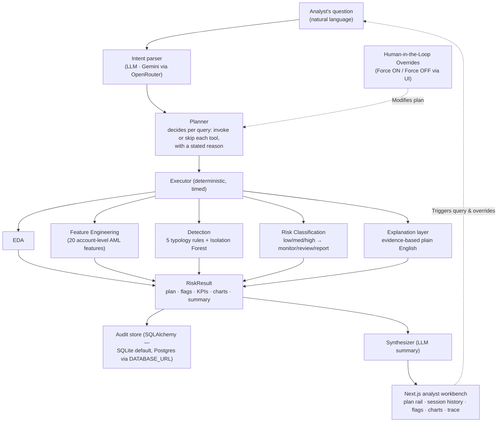

# Argus AML — AI-Powered Suspicious Activity Detection

An agentic system for Anti-Money Laundering (AML) compliance. Instead of running
a fixed pipeline, **Argus** parses a natural-language query, works out what the
user actually wants, and dynamically builds an execution plan — invoking only the
tools needed to answer that specific question.

---

## Problem Statement

### AI-Powered Suspicious Activity Detection

**Business Summary:**

Financial institutions globally are mandated by regulatory bodies (FinCEN, FATF,
local authorities) to implement robust Anti-Money Laundering (AML) compliance
programs. However, traditional rule-based systems generate excessive false
positives, overwhelming compliance teams and increasing operational costs.
Meanwhile, sophisticated money laundering techniques—including structuring,
smurfing, and layering evade conventional detection methods.

The challenge is to build an intelligent, autonomous agent that can learn from
transaction patterns, identify suspicious behaviours, and provide explainable risk
assessments with actionable escalation recommendations. Such an agent would reduce
false positives, improve detection accuracy, and enable compliance teams to focus
on genuine threats rather than manual rule tuning.

**Objective:**

Participants are required to design and implement an AI-powered agent that:

- Performs automated exploratory data analysis (EDA) on transaction and customer data to understand baseline behavior
- Detects anomalous transaction patterns indicative of money laundering (example – structuring/smurfing)
- Applies anomaly detection (e.g., any ML-based approach, rule based or Hybrid)
- Generates a risk score or flag per transaction/customer
- Provides a explanation for why a transaction is flagged as suspicious
- Recommends a basic escalation action (monitor / flag for review / report)

**Requirements:**

Participants must build an agent-driven system and showcase an implementation with
regards to the objective:

The agent must accept a user instruction or query (e.g., "Analyse this dataset for
suspicious activity" or "Flag high-risk customers") and autonomously orchestrate
calls to internal components/tools to complete the task.

**Minimum Functional Requirements**

The agent must not follow a fixed sequential pipeline. Instead, it must parse the
user's natural language query, extract intent, filters, entities, and pattern
types, and dynamically construct an execution plan — invoking only the tools
necessary to answer that specific query. The examples below illustrate the expected
adaptive behaviour:

| User Query | Expected Agent Behaviour |
|------------|--------------------------|
| "Find structuring patterns in the last 30 days" | Apply time filter first; invoke only structuring-focused feature engineering and anomaly detection; skip full EDA |
| "Which customers made 10+ transactions under $10,000?" | Run aggregation and threshold rule directly; ML anomaly detection is not required |
| "Is customer ID 4521 suspicious?" | Perform single-entity lookup; explain existing flags or compute risk on-demand for that customer only |

With that in mind, the agent must be capable of the following — invoked selectively
based on query intent:

- Extract intent, filters (date range, segment, country, transaction type), and target AML pattern
- Build a dynamic execution plan that decides which tools to call, in what order, and on which subset; not every query needs every tool
- Load the dataset and apply only the preprocessing relevant to the query
- Run EDA selectively when broad exploration is needed; skip it for targeted or single-entity queries
- Create AML features on demand, such as transaction frequency, rolling sums, amount deviation, velocity, and rapid cash-out patterns
- Run anomaly or suspicious-pattern detection using ML, statistical, or rule-based methods on the filtered data
- Classify results as low, medium, or high-risk using context-appropriate thresholds
- Generate a human-readable explanation for each flag, tied to the query
- Recommend the next action: monitor, review, or report
- Return results in a structured format that is easy for a judge to inspect, including what the agent decided and why

**Expected Agent Architecture**

The solution should clearly show an agentic flow where the agent coordinates the
following capabilities:

- **EDA Tool:** Performs exploratory data analysis, profiling, and visualization
- **Feature Engineering Tool:** Creates model-ready or rule-ready AML features
- **Anomaly Detection Tool:** Scores suspicious transactions or customers using ML, statistical methods, rules, or a hybrid approach
- **Risk Classification Tool:** Converts scores/signals into risk categories based on model output and/or business logic
- **Explanation Component / Rule Layer:** Generates concise natural language reasons for flags

**Recommended Output from the Agent**

- A query-aware execution summary showing the user request, the filters/entities detected, and the tools the agent decided to invoke
- Top suspicious transactions or customers returned by the selected analysis path
- Risk level for each flagged item
- Explanation for each flag, tied to the original query intent and detected AML pattern
- Suggested escalation action such as monitor / review / report
- Supporting charts, tables, or metrics for reviewer confidence

---

## Dataset

**IBM Transactions for Anti-Money Laundering (AML)**
🔗 https://www.kaggle.com/datasets/ealtman2019/ibm-transactions-for-anti-money-laundering-aml

A large, synthetic-but-realistic dataset of financial transactions between accounts,
with ground-truth laundering labels, timestamps, currencies, and payment formats.

**Files used** — retrieved automatically via
[`kagglehub`](https://github.com/Kaggle/kagglehub) on first run (no manual
download needed). To use local copies instead, set `DATA_PATH_OVERRIDE` /
`ACCOUNTS_PATH_OVERRIDE` in `backend/.env.local` (any placed files stay gitignored):

| File | Rows | Role |
|------|------|------|
| `HI-Small_Trans.csv` | 5,078,345 | transactions (Sep 1–18, 2022) with `Is Laundering` ground truth (5,177 positive) |
| `HI-Small_accounts.csv` | 518,581 | account → bank → entity (customer) directory |
| `HI-Small_Patterns.txt` | — | labeled laundering-typology blocks (fan-out, cycles, …) used for validation |

**Normalized transaction schema** (see `backend/app/data/loader.py`):

```
timestamp · from_bank · from_account · to_bank · to_account ·
amount_received · receiving_currency · amount_paid · payment_currency ·
payment_format · is_laundering
```

Bank ids are kept as strings (they carry leading zeros); currencies and payment
formats become pandas categories; the duplicate raw `Account` columns are renamed
positionally.

**Sampling** (see `backend/app/data/sampler.py`): row-level random sampling would
destroy the per-account sequences AML features depend on, so sampling is done at
the **account level** — every transaction touching a laundering-involved account
is kept (all 5,177 labeled rows survive), plus the full histories of a
deterministic, hash-selected 25% of the remaining accounts (~2.46M rows total).
No RNG: the same sample is produced on every machine. First load builds parquet
caches in `backend/data/`; later loads take ~1s. `GET /dataset/info` reports the
loaded state.

> **Note on filters:** the dataset has no country/segment columns, so those filter
> types from the problem statement are mapped to what the data actually contains —
> banks, currencies, and payment formats. Relative date filters like "last 30
> days" resolve against the dataset's max date (2022-09-18), not today's date.

---

## Getting Started

### Prerequisites

| Tool | Version | macOS / Linux | Windows |
|------|---------|---------------|---------|
| Python | 3.12+ | `brew install python@3.12` | [python.org installer](https://www.python.org/downloads/) — tick **"Add python.exe to PATH"** |
| Node.js | 20.9+ | `brew install node` | [nodejs.org installer](https://nodejs.org/) |
| npm | 10+ | ships with Node | ships with Node |
| git | any | `brew install git` | [git-scm.com](https://git-scm.com/download/win) |

### 1. Clone the repository

```bash
git clone https://github.com/ayushmaninbox/argus-aml.git
cd argus-aml
```

### 2. The dataset

The IBM AML dataset is **downloaded automatically** via `kagglehub` on the first
query — no manual step needed. On first use `kagglehub` will prompt for Kaggle
credentials (or reads them from `~/.kaggle/kaggle.json`); see the
[kagglehub auth docs](https://github.com/Kaggle/kagglehub#authenticate).

Prefer to use a local copy? Download `HI-Small_Trans.csv` and
`HI-Small_accounts.csv` from
[Kaggle](https://www.kaggle.com/datasets/ealtman2019/ibm-transactions-for-anti-money-laundering-aml),
put them anywhere, and point `backend/.env.local` at them (see
[Environment variables](#environment-variables)). The `archive/` folder is
gitignored — data is never committed.

### 3. Backend (FastAPI)

<details open>
<summary><b>macOS / Linux</b></summary>

```bash
cd backend

# create a virtual environment and install dependencies
python3.12 -m venv .venv
source .venv/bin/activate
pip install -r requirements.txt

# configure environment — then edit .env and add your OPENROUTER_API_KEY
cp .env.example .env.local

# run the API (port 8000)
uvicorn app.main:app --reload --port 8000
```
</details>

<details open>
<summary><b>Windows (PowerShell)</b></summary>

```powershell
cd backend

# create a virtual environment and install dependencies
py -3.12 -m venv .venv
.\.venv\Scripts\Activate.ps1
pip install -r requirements.txt

# configure environment — then edit .env and add your OPENROUTER_API_KEY
copy .env.example .env.local

# run the API (port 8000)
uvicorn app.main:app --reload --port 8000
```

> If PowerShell blocks the activation script, run once:
> `Set-ExecutionPolicy -Scope CurrentUser -ExecutionPolicy RemoteSigned`
</details>

Verify (any OS): open **http://localhost:8000/health** in a browser, or:

```bash
curl http://localhost:8000/health
# {"status":"ok","service":"argus-aml", ... "dataset_present":true}
```

### 4. Frontend (Next.js)

In a **second terminal** (same on macOS / Linux / Windows):

```bash
cd frontend
npm install
npm run dev
```

Open **http://localhost:3000** — the status pill in the header turns green
("API online") once the backend is running.

### Environment variables

Set these in `backend/.env` (backend) or `frontend/.env.local` (frontend).
Both `.env` and `.env.local` are gitignored; `.env.local` overrides `.env`.

| Variable | Where | Required | Default | Purpose |
|----------|-------|----------|---------|---------|
| `OPENROUTER_API_KEY` | `backend/.env` | for agent endpoints | — | LLM calls (intent parsing + synthesis) |
| `OPENROUTER_MODEL` | `backend/.env` | no | `google/gemini-2.5-flash` | LLM model id |
| `DATABASE_URL` | `backend/.env` | no | `sqlite:///backend/argus.db` | Audit store; point at Postgres in production — no code change |
| `DATA_PATH_OVERRIDE` | `backend/.env` | no | — (kagglehub download) | Use a local `HI-Small_Trans.csv` instead of downloading |
| `ACCOUNTS_PATH_OVERRIDE` | `backend/.env` | no | — (kagglehub download) | Use a local `HI-Small_accounts.csv` |
| `NEXT_PUBLIC_API_URL` | `frontend/.env.local` | no | `http://localhost:8000` | Backend URL used by the UI |

Example `backend/.env.local` to run fully offline from local files:

```ini
OPENROUTER_API_KEY=sk-or-...
DATA_PATH_OVERRIDE=C:\Users\you\data\HI-Small_Trans.csv        # Windows
ACCOUNTS_PATH_OVERRIDE=C:\Users\you\data\HI-Small_accounts.csv
# macOS/Linux: /Users/you/data/HI-Small_Trans.csv
```

### Troubleshooting

- **Status pill stays red / "API offline"** — the backend isn't running, or
  something else is occupying port 8000. Check the port:
  - macOS / Linux: `lsof -i :8000`
  - Windows (PowerShell): `Get-NetTCPConnection -LocalPort 8000`

  Either stop that process, or run uvicorn on another port
  (`uvicorn app.main:app --port 8010`) — the UI accepts any localhost port and
  you can set `NEXT_PUBLIC_API_URL` accordingly.
- **First query is slow** — `kagglehub` is downloading ~450 MB on first use;
  subsequent runs read the cached copy.
- **kagglehub auth error** — configure Kaggle credentials (see step 2), or use
  `DATA_PATH_OVERRIDE` / `ACCOUNTS_PATH_OVERRIDE` to skip the download entirely.
- **`dataset_present: false` in `/health`** — the dataset can't be located; set
  the override variables to valid local file paths.

---

### The agent endpoint

```bash
curl -X POST http://localhost:8000/query \
  -H 'Content-Type: application/json' \
  -d '{"query": "Find structuring patterns in the last 30 days"}'
```

Response: `run_id`, `plan` (intent, filters, every tool invoked/skipped with
reasons and per-step timings), `flags` (risk level, score, plain-English
reason, escalation), `kpis`, `charts`, `summary`. The LLM parses the query and
writes the summary; **flags are decided only by deterministic tools + ML** —
the same query on the same data always yields the same flags.

## Architecture



The LLM parses questions and writes summaries — **it never decides a flag**.
Detection is deterministic rules + an unsupervised model, so the same query on
the same data always produces the same flags (a compliance requirement).

## Validation

Scored against IBM's ground truth, which detection never sees

- **96%** precision in the top-50 flag queue (48/50 are labeled laundering accounts)
- **78%** of the 370 labeled laundering attempts caught, across all 8 typology families
- Threshold tuning against the labels cut flag volume **15%** while holding coverage
- 2.46M-row sample analysed end-to-end in ~9s (warm) on a laptop

### Running Validation and E2E Tests

The repository contains two validation scripts in the `backend/` directory:

1. **Detector Validation against Ground Truth**:
   Evaluates the rule detectors and Isolation Forest models against IBM's 370 labeled laundering patterns in `HI-Small_Patterns.txt` to calculate coverage and precision metrics.
   ```bash
   cd backend
   source .venv/bin/activate
   python validate.py
   ```
   To run with candidate thresholds (tuned to optimize queue efficiency):
   ```bash
   python validate.py --candidate
   ```

2. **Live E2E Agent Query Verification**:
   Sends the four target demo queries to the live backend server on port 8000 to verify LLM intent parsing, planning, execution timings, and formatting. Ensure the backend server is running first.
   ```bash
   cd backend
   source .venv/bin/activate
   python verify_live.py
   ```

## Tech Stack

- **Backend:** Python 3.12 · FastAPI · pandas · scikit-learn · SQLAlchemy
- **Frontend:** Next.js 16 · React 19 · Tailwind CSS v4
- **Detection:** Hybrid (deterministic AML typology rules + Isolation Forest)
- **Agent reasoning:** Gemini 2.5 Flash via OpenRouter (routes & explains; never decides flags)

## Disclosure — external tools, APIs & AI assistance

- **Dataset:** [IBM Transactions for AML](https://www.kaggle.com/datasets/ealtman2019/ibm-transactions-for-anti-money-laundering-aml) (Kaggle) — transactions, account directory, and labeled pattern files
- **LLM API:** Gemini 2.5 Flash via [OpenRouter](https://openrouter.ai) — query intent parsing and result summaries only
- **Open-source libraries:** FastAPI, uvicorn, pandas, pyarrow, scikit-learn, SQLAlchemy, httpx, pydantic, pytest, kagglehub, Next.js, React, Tailwind CSS
